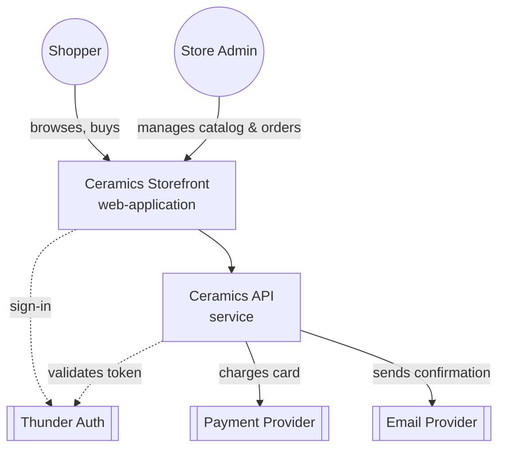
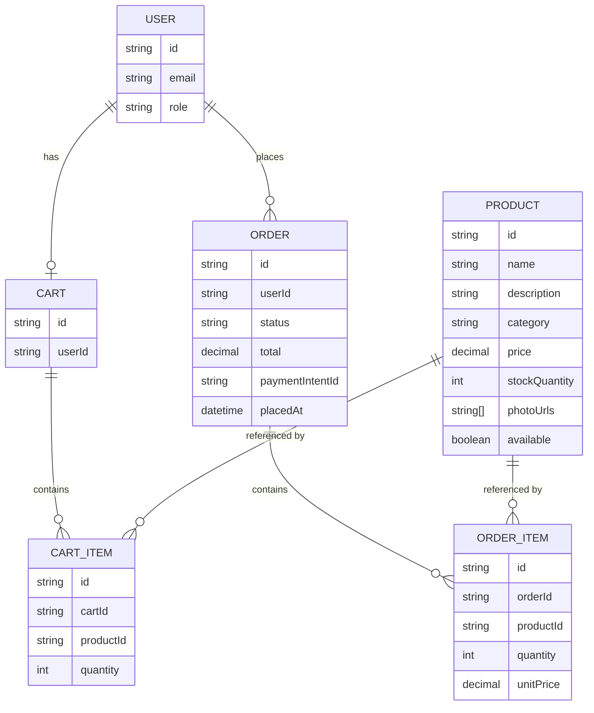
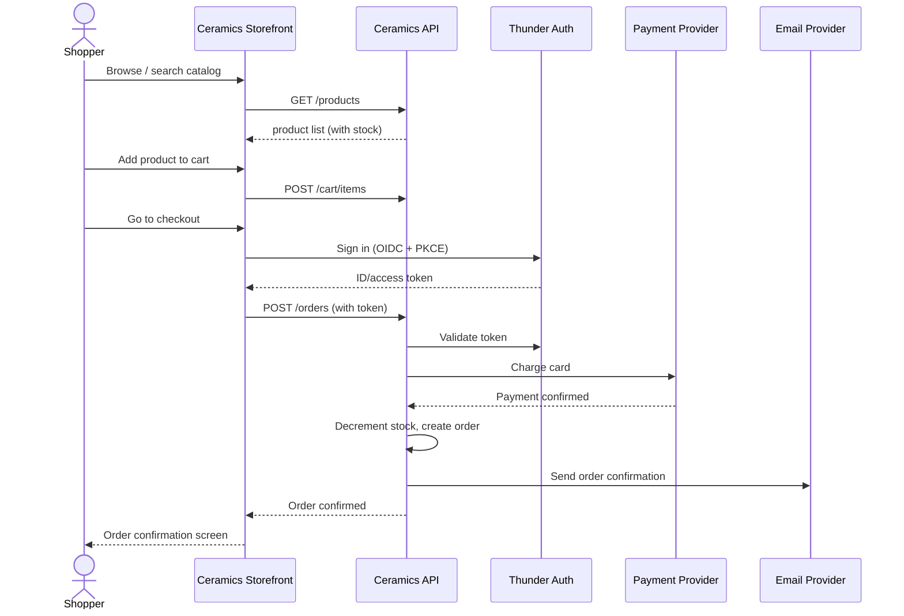
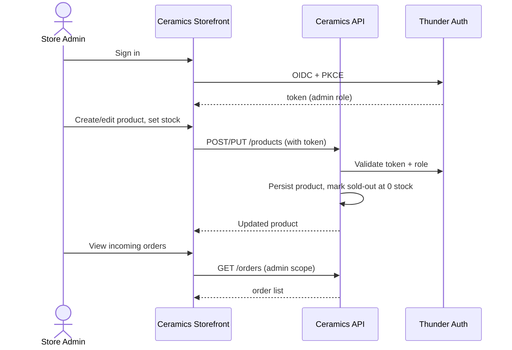

# Handmade Ceramics Store — Design

## Overview

The store is a single-seller e-commerce system made of one React SPA
(`ceramics-webapp`) and one Ballerina backend (`ceramics-api`). The SPA serves
both the Shopper storefront (catalog, cart, checkout, order history) and the
Store Admin console (catalog and stock management, order fulfillment view),
gated by role after Thunder SSO sign-in. The API owns all product, cart,
order, payment, and notification logic behind a single Postgres-backed
service, calls a payment gateway to process card payments, and sends order
confirmation email through an email provider.

## Context (C1)

## Domain model (ER)

## Key flows

### Shopper: browse, cart, and checkout

### Store Admin: manage catalog and stock

